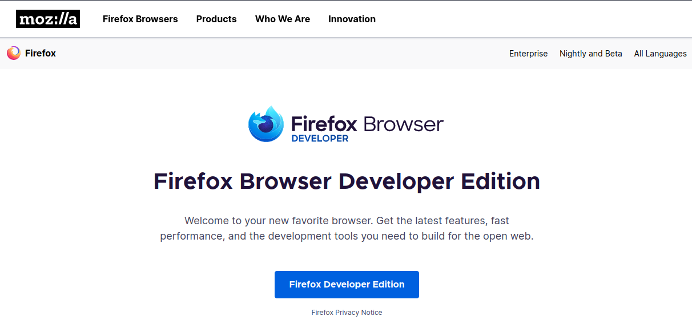

# LinuxDebian

## Table Of Contents

- [Installing debian without any desktop environment](#installing-debian-without-any-desktop-environment)
- [Connect to wifi from command line](#connect-to-wifi-from-command-line)
- [Change apt package source](#change-apt-package-source)
- [Nala apt front-end for Linux](#install-nala-better-apt-front-end)
- [Automatically download all firmware packages](#automatically-download-all-the-required-firmware-packages)
- [Fix Grub dual boot problem](#fix-grub-dual-boot-problem)
- [Install Firefox Developer Edition Browser](#install-firefox-developer-edition-browser)
- [Uncompress Common linux file types](#uncompress-common-linux-file-types)
  - [Cli Compression Programs](#cli-compression-programs)
  - [Graphical Compression Programs](#graphical-compression-programs)

---

## Installing Debian without any Desktop Environment

---

> ### Note: If you have ethernet connected for internet connection jump to next step [here](#change-apt-package-source).

## Connect to wifi from command line

- Show all the available network interface

```shell
$ ip a
```

- Show your wireless network interface

```shell
$ sudo iw dev
```

- Set the wireless interface up which start with wlpxxx since mine is wlsps0b1, the command is:

```shell
$ sudo ip link set wlp2s0b1 up
```

- Edit the interfaces with your favourite text editor like vim, nano, etc. Since I am familier with nano for my setup.

```shell
$ sudo nano /etc/network/interfaces
```

- Copy and paste the following text at the end of the file and replace ESSID with your **'wifi name'** and PASSWORD with your **'wifi password'**

```nano
# my wifi device
allow-hotplug wlp2s0b1
iface wlp2s0b1 inet dhcp
  wpa-ssid ESSID #wifi name/essid
  wpa-psk PASSWORD #wifi password
```

- Bring up your interface and verify connection :

```shell
$ sudo ifup wlp2s0b1
$ ip a #To view if wlp2s0b1 is UP or DOWN
```

> Note: If this method doesn't work visit official wiki [here](https://wiki.debian.org/WiFi/HowToUse).

---

## Install NetworkManager

```shell
sudo apt install network-manager
```

---

## Change apt package source

> This section is optional. If you want latest and greatest debian packages then changing the source from **'bulleye'** to either **'sid'** or **'testing'** is a great idea.

- If you want to learn more about Debian Release and Stability then refer to the following official articles:

  [About Different Debian Releases](https://www.debian.org/releases/)

  [About Debian Stability](https://wiki.debian.org/DebianStability)

- For my setup I changed my sources in source.list from **'bulleye'** to **'sid'**.

```shell
$ sudo nano /etc/apt/source.list
```

> ### It will look similar to this ( Ignore the comments ) :

```nano
deb http://deb.debian.org/debian bullseye main
deb-src http://deb.debian.org/debian bullseye main

deb http://deb.debian.org/debian-security/ bullseye-security main
deb-src http://deb.debian.org/debian-security/ bullseye-security main

deb http://deb.debian.org/debian bullseye-updates main
deb-src http://deb.debian.org/debian bullseye-updates main
```

> ### Change the fist and second 'bulleye' to 'sid' as shown below:

```nano
deb http://deb.debian.org/debian sid main
deb-src http://deb.debian.org/debian sid main

deb http://deb.debian.org/debian-security/ bullseye-security main
deb-src http://deb.debian.org/debian-security/ bullseye-security main

deb http://deb.debian.org/debian bullseye-updates main
deb-src http://deb.debian.org/debian bullseye-updates main
```

> Note : If you want different **'soure.list'** configuration visit [here](https://wiki.debian.org/SourcesList).

- After changing the source list **'update'** and **'upgrade'** your system :

```shell
$ sudo apt update && sudo apt upgrade
```

---

## Install 'nala' better 'apt' front-end

- When it come to installing packages from apt it is a mess. When you are installing packages nala provides a better interfaces while installing packages. So it is my prefered way. I recommend nala to everyone. To install nala in debian use the following command:

```shell
$ sudo apt install nala
```

> Note: If nala isn't installed from the above method. Click [here](https://gitlab.com/volian/nala/-/wikis/Installation) to vist nala official install wiki.

---

## Automatically download all the required firmware packages

- It is rather simple to download all the **'reqired'** and **'missing'** firmware packages inside Debian. For this we need to install **isenkram-cli** package.

```shell
$ sudo nala install isenkram-cli
```

- To install missing **'reqired'** and **'missing'** firmware packages run the following command:

```shell
$ sudo isenkram-autoinstall-firmware
```

> For more details visit [here](https://www.debian.org/releases/stable/i386/ch06s04.en.html).

---

## Fix Grub dual boot problem

- This problem occurs when you update and upgrade your system. A simple way to fix this is by following given commands:

```shell
$ sudo nano /etc/default/grub
```

- Search and uncomment the following line :

```nano
GRUB_DISABLE_OS_PROBER=false
```

- Run the following command to enable **'os prober'** and **'update grub'**. This will automatically detect your another operating system.

```shell
$ sudo os-prober
$ sudo update-grub
```

---

## Install Firefox Developer Edition Browser

- Click [here](https://www.mozilla.org/en-US/firefox/developer/) to visit **'Firefox Developer Edition'** download page and click on Firefox Developer Edition button to download **'.tar.bz2'** file.



- Install some dependencies for browser to work properly run the following command:

```shell
$ sudo nala install libgtk2.0-0 libasound2 libdbus-glib-1-2
```

- Navigate to the **'Downloads'** directory :

```shell
$ cd Downloads
```

- Install **'Firefox Developer Edition'** browser with the following command:

```shell
$ sudo tar xjf firefox-*.tar.bz2 -C /opt
```

> Note: Above command will extract all files from firefox-\*.tar.bz2 to the /opt/firefox directory.

- Create a soft link or symlink of **'firefox'** file under **'/usr/local/bin/'** directory, so it will be accessible from anywhere the system:
  - For all users
  ```shell
  $ sudo ln -s /opt/firefox/firefox /usr/bin/firefox-developer-edition
  ```
  - For Single user with name **'Username'**
  ```shell
  $ sudo ln -s /opt/firefox/firefox /usr/local/bin/firefox-developer-edition
  ```

> Note: You can use use any name instead of **firefox-developer-edition** like **firefox-dev**

- Start **'Firefox Developer Edition'** from the terminal by running the following command:

```Shell
$ sudo firefox-developer-edition.desktop
```

- Create an GUI executable to start **'Firefox Developer Edition'** from Application Launcher, Search, etc. :

  - For all users

  ```Shell
  $ sudo nano usr/share/applications/firefox-developer-edition.desktop
  ```

  - For Single user with name **'Username'**

  ```Shell
  $ sudo nano home/<Username>/.local/share/applications/firefox-developer-edition.desktop
  ```

> ### Copy and paste the following text:

```desktop
[Desktop Entry]
Name=Firefox Developer Edition
GenericName=Web Browser
Comment=Web Browser
Exec=/usr/bin/firefox-developer-edition %U
StartupNotify=true
Terminal=false
Icon=firefox-developer-edition
Type=Application
Categories=Network;WebBrowser;
MimeType=application/pdf;application/rss+xml;application/rdf+xml;application/xhtml+xml;application/xhtml_xml;application/xml;application/vnd.mozilla.xul+xml;image/gif;image/jpeg;image/png;image/webp;text/html;text/xml;x-scheme-handler/http;x-scheme-handler/https;
Actions=new-window;new-private-window;

[Desktop Action new-window]
Name=New Window
Exec=/usr/bin/firefox-developer-edition

[Desktop Action new-private-window]
Name=New Incognito Window
Exec=/usr/bin/firefox-developer-edition --private-window

```

---

## Install wayland with weston or sway for tile layout

- Visit [here](https://blog.aktsbot.in/swaywm-on-debian-11.html) to setup sway in debian.

---

## Install bspwm window manager with rofi

- Visit CTT [here](https://github.com/ChrisTitusTech/Debian-titus) to setup bspwm with rofi.
- Customize rofi [here](https://github.com/adi1090x/rofi).

---

## Install system utilities tool

bpytop - Cli Based system monitor
stacer - System utility program
reshift-gtk - Equivalent to f.lux in windows
neofetch - shows system information

## Install nix best package manager

## Install QEMEU instead of virtuax box

## Install docker and docker compose, portainor

## Install File light

## Install with xfce lightweight desktop environment (Optional)

Install Material-Black-Pistachio-2.9.3 theme

## Some Linux Commands

- apropos (Find command related to a keyword)

```shell
$ apropos <keyword>
```

> For example : You can use `apropos disk` to find the commands related to keyword **'disk'**.

- whoami (Print the user name associated with the current effective user ID)

```shell
$ whoami
```

- disk and partaition commands
  blkid
  fdisk

## Uncompress common linux file types

> ### CLI Compression Programs
>
> Note: We will learn to uncompress common linux files like .tar, .tar.gz and .tar.bz2

- To uncompress .tar file use one of the following commands :

  > Copy in same working directory

  ```shell
  $ tar -xf <filename>.tar
  ```

  > Copy to a destination directory

  ```shell
  $ tar -xf <filename>.tar -C /path/to/destination/directory
  ```

- To uncompress .tar.gz file use one of the following commands :

  > Copy in same working directory

  ```shell
  $ tar -xzvf <filename>.tar.gz
  ```

  > Copy to a destination directory

  ```shell
  $ tar -xzvf <filename>.tar.gz -C /path/to/destination/directory
  ```

- To uncompress .tar.bz2 file use one of the following commands :
  > Copy in same working directory
  ```shell
  $ tar -xjvf <filename>.tar.bz2
  ```
  > Copy to a destination directory
  ```shell
  $ tar -xjvf <filename>.tar.bz2 -C /path/to/destination/directory
  ```

> ### Graphical Compression Programs:

- [File Roller](https://gitlab.gnome.org/GNOME/file-roller)

```shell
$ sudo nala install file-roller
```

- [Ark](https://github.com/KDE/ark)

  ```shell
  $ sudo nala install ark
  ```

- [PeaZip](https://peazip.github.io/)
  > For GTK version
  ```shell
  $ wget "https://github.com/peazip/PeaZip/releases/download/9.1.0/peazip_9.1.0.LINUX.GTK2-1_amd64.deb"
  ```
  Or
  > For Qt version
  ```shell
  $ wget "https://github.com/peazip/PeaZip/releases/download/9.1.0/peazip_9.1.0.LINUX.Qt5-1_amd64.deb"
  ```
  Then
  ```shell
  $ cd ~/Dowloads
  $ dpkg -i peazip_*.deb
  ```
